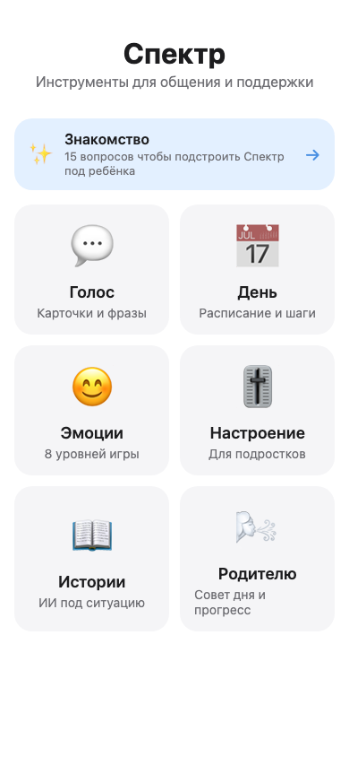
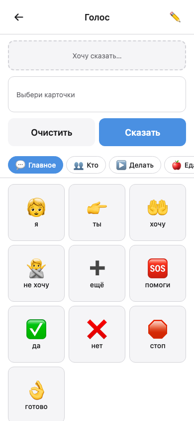
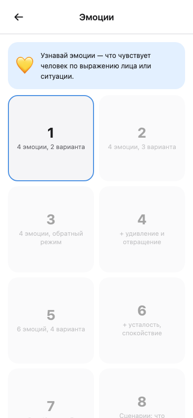
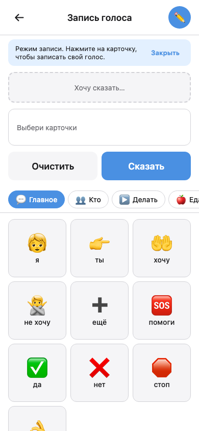
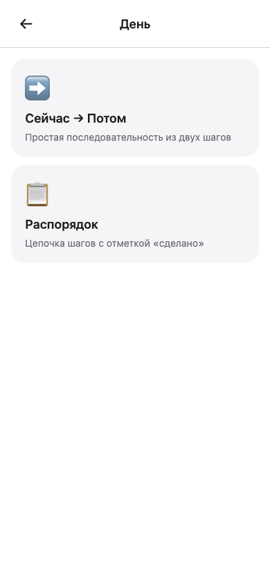
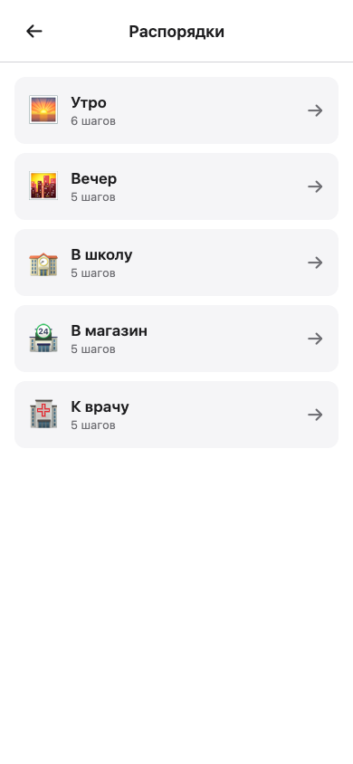
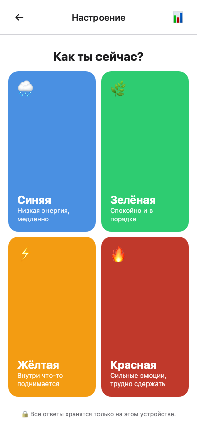
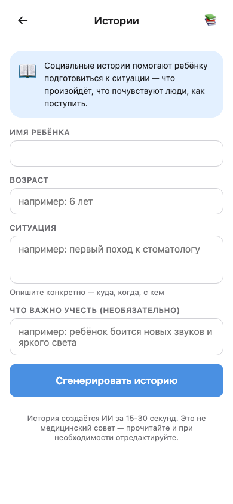
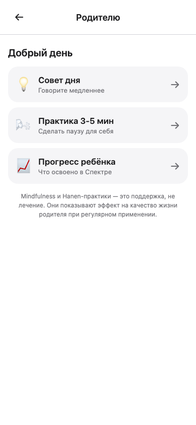

# Спектр

> Бесплатное TG mini-app + PWA для семей с детьми и подростками с расстройством аутистического спектра (РАС). 6 модулей, работает офлайн, без рекламы, без подписки, без сбора персональных данных. Русскоязычное, под российский быт.

🌐 **https://spectrum-app.fly.dev** · 📦 9 спринтов · 🇷🇺 ru-RU только

<table>
<tr>
<td></td>
<td></td>
<td></td>
</tr>
<tr>
<td align="center">Хаб — 6 модулей</td>
<td align="center">AAC «Голос»</td>
<td align="center">Игра «Эмоции»</td>
</tr>
</table>

## Зачем

Сейчас (2026) у русскоязычной аудитории нет качественного бесплатного AAC: Proloquo2Go стоит $300 и доступен только на iOS, российские альтернативы — 3.5★ любительский UX. При этом TG mini-app формат снимает все стандартные friction-points: нет Apple ID, нет валютной оплаты, нет обхода блокировок стора. Открыл ссылку — работает.

Все принципы построены на peer-reviewed research 2023–2026: PECS (мета 2025 n=2343), JASPER (UCLA), Zones of Regulation (Kuypers), Carol Gray 10.4, FaceSay (UCLA), Hanen More Than Words, MYmind. Полный обзор с ~80 ссылками — в [соседнем репо `roghans_tg_bot/docs/research/asd_app_research.md`](../roghans_tg_bot/tg-bot/docs/research/asd_app_research.md).

## Что внутри

| # | Модуль | Аудитория | Основа | URL |
|---|---|---|---|---|
| 1 | ✨ Знакомство | Родитель при первом входе | Sensory Profile 2 (Dunn) — упрощённо | `/onboarding` |
| 2 | 💬 Голос (AAC) | Дети 2-7, non-verbal / minimally verbal | PECS Phase I + custom voice recording | `/aac` |
| 3 | 📅 День | Дети 2-8 | First-Then board + structured routines | `/day` |
| 4 | 😊 Эмоции | Дети 4-10 | FaceSay-style progressive levels | `/emotions` |
| 5 | 🎚️ Настроение | Подростки ASD Level 1 | Zones of Regulation + CBT coping | `/mood` |
| 6 | 📖 Истории | Родитель → ребёнок | Carol Gray 10.4 + Claude API | `/stories` |
| 7 | 🌬️ Родителю | Родитель | Hanen MTW + MYmind + dashboard | `/parent` |

### 💬 Голос — AAC по протоколу PECS

60 русских core-words в 6 категориях (главное / кто / делать / еда / чувства / где) с emoji-пиктограммами. Sentence strip собирает фразу, кнопка «Сказать» произносит через Web Speech API (ru-RU).

**Custom voice recording** — родитель может записать свой голос для каждой карточки через MediaRecorder API; запись хранится в IndexedDB локально. При тапе ребёнка играется родительский голос вместо синтезатора — теплее, узнаваемее.



### 📅 День — визуальное расписание

Два режима: **Сейчас → Потом** (one-step transition с 28-activity picker) и **Распорядок** (5 готовых шаблонов: утро / вечер / в школу / в магазин / к врачу). Пошаговое UI: большое лицо текущего шага, прогресс-бар, upcoming preview, кнопки «Готово / Пропустить».

<table>
<tr>
<td></td>
<td></td>
</tr>
</table>

### 😊 Эмоции — FaceSay-style

8 progressive уровней с adaptive difficulty:
- L1-3: 4 базовые эмоции (joy/sadness/anger/fear), 2-3 варианта
- L4-6: + удивление, отвращение, усталость, спокойствие
- L7: все 12 эмоций, 4 варианта
- L8: контекстуальные сценарии («Папа крепко обнимает после долгого дня» → любовь или спокойствие)

8 вопросов на уровень, pass at 6/8. Уровни запираются до прохождения предыдущего.

### 🎚️ Настроение — Zones of Regulation

Daily check-in для подростков ASD Level 1 с коморбидной тревожностью (40–50% популяции). 4 цветовые зоны → 22 триггера в 6 категориях (сенсорное / социальное / учёба / тело / позитив / другое) → 8 coping-стратегий, включая «Стимить — это работает, не подавляй» (neurodiversity-affirming формулировка). История с stats 7/30 дней.



### 📖 Истории — AI Social Stories по Carol Gray 10.4

Родитель описывает ситуацию (имя ребёнка, возраст, контекст), Claude генерит social story с правильными пропорциями типов предложений: **D**escriptive / **P**erspective / **A**ffirmative / **Dir**ective (директивных не больше 25% — ключевое правило Carol Gray). Сервер валидирует структуру. История рендерится с цветовой маркировкой типов, можно сохранить в библиотеку.



### 🌬️ Родителю — Hanen + MYmind + Dashboard

- **Совет дня** — 15 ротирующихся Hanen-стратегий (OWL «Observe-Wait-Listen», 4S «Say less / Stress / Slow / Show», MTW «More Than Words»). Deterministic по дате, streak counter
- **Практика 3-5 мин** — 5 mindfulness-скриптов (дыхание 4-6, body scan, пауза перед реакцией, self-compassion break, grounding)
- **Прогресс ребёнка** — dashboard читающий localStorage из всех модулей: sensory profile, эмоции, mood, distinct day-routines, AAC voice recordings, родительские практики



## 8 принципов продукта

1. **Neurodiversity-affirming** — никогда не «лечение», только «поддержка навыков». Stimming разрешён и поощряется
2. **Sensory-friendly UX by default** — mute on start (кроме AAC), prefers-reduced-motion respected, dark mode, WCAG AA+, **никаких** surprise sounds / pop-ups / random rewards
3. **Sensory profile personalization** — 15-item Dunn-style → 4 профиля для адаптации UI
4. **Predictable structure** — одинаковый layout, кнопки в одних местах (по Friston: снижает high-precision prediction errors)
5. **Child-led** — выбор активности за ребёнком (PRT child choice), reinforcement = продолжение игры
6. **Parent-mediated layer** — параллельный adult-track (mindfulness работает на родителя больше, чем на подростка — MYmind data)
7. **Evidence-anchored** — каждая фича привязана к published intervention
8. **No friction access** — TG mini-app + PWA, открыл ссылку → работает офлайн

## Что НЕ делаем

- ❌ Surprise rewards / random animations / jump scares
- ❌ Реклама / pop-ups / in-app purchases для детей
- ❌ Time pressure / leaderboards / competitive elements
- ❌ Промоутировать GFCF-диеты, MMS, хеляцию, weighted vests, AIT (псевдонаука)
- ❌ Позиционировать как «лечение РАС» / «нормализацию»
- ❌ Flickering / strobe / autoplay video со звуком
- ❌ Sharing данных с третьими лицами

## Privacy

- Все пользовательские данные хранятся **локально** в `localStorage` / `IndexedDB` (sensory profile, mood history, AAC custom voice, эмоции progress, parent state)
- На сервер уходит только **агрегированная телеметрия** в `data/events.jsonl` — без личного контента. Mood-triggers логируются только как категории («sensory» / «social»), не как конкретный текст
- AI Stories вызовы идут на Anthropic API (без сохранения на стороне Спектра)
- Никакого third-party tracking / analytics / ads

## PWA + offline

- ✅ Installable (icon на homescreen) — `manifest.webmanifest` с 5 icon-size + 2 shortcuts (Голос / День)
- ✅ Полностью **offline-capable** — service worker precache 41 файла на install
- ✅ Stale-while-revalidate для shell-ресурсов, network-only для `/api/*`
- ✅ Navigation fallback на cached `/` если страница недоступна
- ✅ `CACHE_VERSION` versionируется → старый кэш удаляется на activate

**Главный win:** AAC работает в местах без интернета (поликлиники, метро, очереди — где обычно случаются meltdowns и нужна коммуникация).

## Tech stack

| Слой | Что |
|---|---|
| Backend | Python 3.12 + aiohttp + python-telegram-bot + anthropic SDK |
| Frontend | Vanilla JS, Telegram WebApp SDK, PWA (service worker + manifest) |
| Storage | `data/events.jsonl` (server telemetry), `localStorage` (user state), `IndexedDB` (voice blobs) |
| TTS | Web Speech API (`SpeechSynthesisUtterance`, ru-RU) |
| AI | Anthropic Claude (sonnet-4-5) для Social Stories |
| Audio recording | MediaRecorder API (webm/opus → mp4 → ogg auto-pick) |
| Deploy | fly.io · отдельный app `spectrum-app` (не пересекается с другими) |
| CI/CD | GitHub Actions: tests on PR, deploy на push в main |
| Container | Docker (python:3.12-slim, non-root user, `/data` mount) |

## Структура

```
spectrum-app/
├── bot.py                       # aiohttp web server + routes
├── modules/
│   └── stories.py               # Anthropic Claude wrapper для Social Stories
├── static/
│   ├── index.html               # 🏠 хаб с 6 тайлами
│   ├── aac.html                 # 💬 AAC коммуникатор
│   ├── day.html                 # 📅 расписание
│   ├── emotions.html            # 😊 игра эмоций
│   ├── mood.html                # 🎚️ mood tracker
│   ├── stories.html             # 📖 AI stories
│   ├── parent.html              # 🌬️ родительский трек
│   ├── onboarding.html          # ✨ sensory profile
│   ├── sw.js                    # service worker
│   ├── manifest.webmanifest     # PWA manifest
│   ├── css/                     # tokens + per-module styles
│   ├── js/                      # per-module logic + voice_storage/recorder + pwa
│   ├── assets/                  # icons (SVG + 192/256/384/512 PNG)
│   └── data/                    # vocabulary, questionnaires, routines, scenarios
├── data/                        # events.jsonl (gitignored)
├── docs/
│   ├── PRODUCT_BRIEF.md
│   └── screenshots/             # production screenshots
├── tests/
│   ├── smoke_visual.py          # playwright iPhone viewport
│   └── smoke_pwa.py             # SW + offline test
├── .github/workflows/
│   ├── test.yml                 # smoke + playwright + HTTP probes
│   └── deploy.yml               # auto-deploy on push в main
├── Dockerfile
├── fly.toml
└── requirements.txt
```

## Локальный запуск

```bash
git clone https://github.com/roghansTeam/spectrum-app.git
cd spectrum-app
python3 -m venv .venv
.venv/bin/pip install -r requirements.txt
.venv/bin/python bot.py
# открыть http://localhost:8080
```

Для генерации Stories через AI — установите `ANTHROPIC_API_KEY`:

```bash
ANTHROPIC_API_KEY=sk-ant-... .venv/bin/python bot.py
```

## Deploy

Автоматический через GitHub Actions: push в `main` → `deploy.yml` → `flyctl deploy`. CI должен пройти (~1 минута). Деплой ~30 секунд.

Секреты:
- `FLY_API_TOKEN` — для GitHub Actions deploy
- `ANTHROPIC_API_KEY` — для `/api/stories/generate` (без него возвращает 502 с user-friendly ошибкой, остальные модули работают)

## Метрики успеха

**Primary**: семьи с активным использованием AAC ≥4 недели (4-week retention).

**Secondary**:
- N произнесённых фраз `aac_phrase_say` / неделя
- Avg sentence length (proxy for language complexity)
- Routine completions / неделя
- Mood entries / подросток / неделя
- Stories generated / семья / месяц

**Anti-metric**: time-in-app — НЕ показатель success. Ребёнок может залипнуть в одной игре.

## Roadmap (Now / Next / Later)

**Now (Q3 2026)** — то что готово к закрытой бете:
- ✅ Все 6 модулей + знакомство в проде
- ✅ Offline-mode + installable PWA
- ⏳ Закрытая бета 5–10 семей через фонды «Выход» / «Антон тут рядом»
- ⏳ TG bot обвязка для native mini-app шторки

**Next (Q4 2026)**:
- PECS Phase II–IV (drag-and-drop в зону партнёра, sentence builder)
- Замена emoji на ARASAAC / fal.ai пиктограммы для AAC
- Custom routine builder (родитель собирает свой `/day`)
- Опциональный B2B-dashboard для специалистов (SLP / ABA / коррекционный педагог)

**Later (2027+)**:
- Audio-guided mindfulness (вместо текста)
- Видеомоделирование (POV daily living scenarios)
- Joint Attention game через front-camera + MediaPipe FaceMesh
- Marketplace библиотек для родителей (custom-сценарии, кастом-vocabulary)

## Лицензия

Code: MIT (планируется)
Educational content & data files: CC BY-NC-SA 4.0 (планируется)

## Owners

- Product: [@skol4356](https://t.me/skol4356) (Сергей Колокольцев)
- Engineering: Claude · @skol4356

## Связь и contributions

Pull requests welcome. Если у вас есть feedback — open issue. Если вы родитель ребёнка с РАС и хотите попасть в бету — напишите в [@skol4356](https://t.me/skol4356).

---

**Built with ❤️ for families that deserve better tools.**
