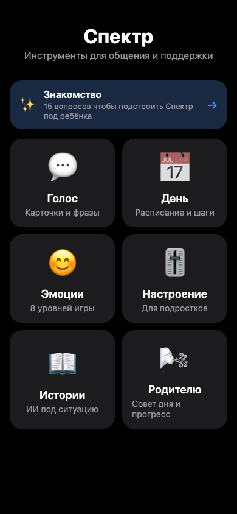
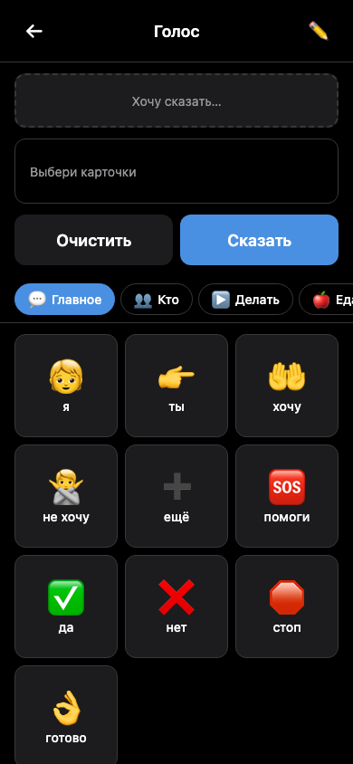
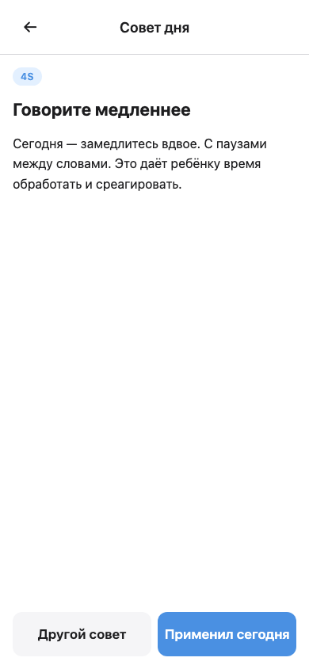
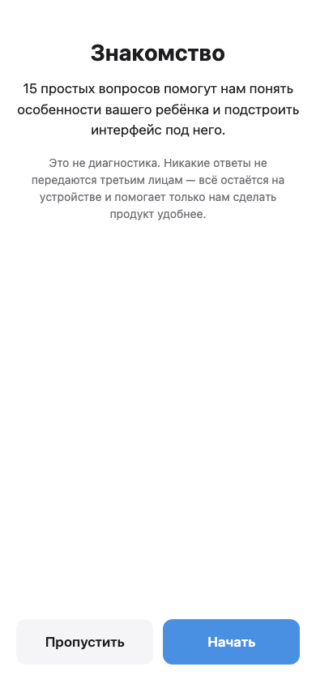

# Скриншоты — production state (machine v9)

Все скрины сняты на проде через playwright headless Chromium с UA Telegram-iOS, viewport iPhone 14 (390×844). Light + dark mode.

## 🏠 Хаб

6 активных модулей + банер «Знакомство» (если sensory profile ещё не пройден):

| Light | Dark |
|---|---|
|  |  |

## 💬 Голос — AAC коммуникатор (PECS Phase I + custom voice)

| Обычный режим | Режим записи родительского голоса | Dark mode |
|---|---|---|
|  |  |  |

60 слов в 6 категориях (главное / кто / делать / еда / чувства / где).

## 📅 День — визуальное расписание

| Hub (2 режима) | Распорядки |
|---|---|
|  |  |

5 готовых routine-шаблонов: Утро / Вечер / В школу / В магазин / К врачу.

## 😊 Эмоции — игра распознавания

8 progressive уровней, открываются по мере прохождения предыдущих.

## 🎚️ Настроение — Mood Tracker для подростков

4 цветовые зоны (Zones of Regulation) → триггеры (опционально) → coping suggestions при yellow/red.

## 📖 Истории — AI Social Stories

Форма с автозаполнением имени/возраста, Claude генерит story по Carol Gray 10.4 criteria.

## 🌬️ Родителю — Hanen + MYmind + Dashboard

| Hub | Совет дня |
|---|---|
|  |  |

15 ротирующихся Hanen-стратегий (OWL / 4S / MTW), 5 mindfulness-практик, progress dashboard читающий localStorage из всех модулей.

## ✨ Знакомство — Sensory Profile onboarding

15-item Dunn-style опросник определяет sensory profile ребёнка (seeking / hyper / hypo / mixed) → результат сохраняется в localStorage и используется для адаптации UI.

---

**Все скриншоты обновляются автоматически через `tests/capture_prod.py`.** Чтобы пересобрать — запустите скрипт; он перезапишет файлы в `docs/screenshots/`.
